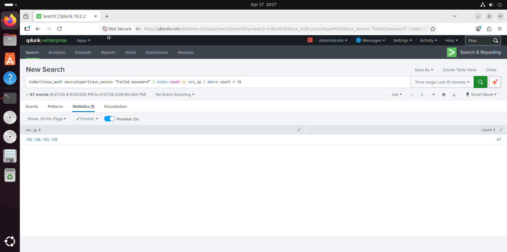

# 🔐 Brute Force Detection

## 🎯 Detection Goal
Detect repeated failed login attempts.

---

## 📊 SPL Query
```spl
index=linux_auth sourcetype=linux_secure "Failed password" | stats count by src_ip | where count > 10
```
## 📸 Detection Evidence


## 🧠 Explanation
Multiple failed login attempts from a single IP indicate brute-force activity.
