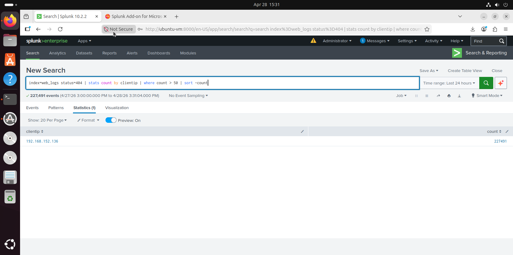

# 🌐 Gobuster Enumeration Detection

## 🎯 Detection Goal
Detect directory brute-force activity using abnormal 404 responses.

---

## 📊 SPL Query
```spl
index=web_logs status=404 | stats count by clientip | where count > 50 | sort -count
```
## 📸 Detection Evidence


## 🧠 Explanation
High 404 responses from a single IP indicate directory enumeration activity.
