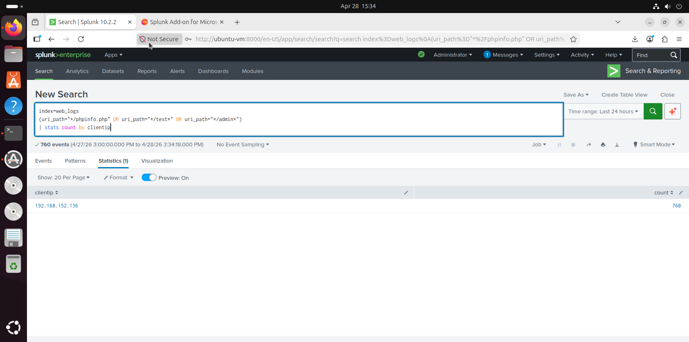

# 🧪 nikto-vulnerability-scan/README.md

```markdown
# 🧪 Nikto Vulnerability Scan Detection

## 🎯 Detection Goal
Detect automated vulnerability scanning behavior.

---

## 📊 SPL Query
```spl
index=web_logs | stats count dc(uri_path) as unique_paths by clientip | where unique_paths > 30
```
## 📸 Detection Evidence

