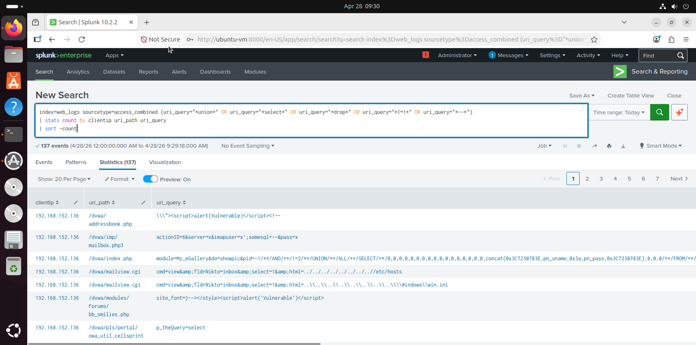

# 💉 SQL Injection Detection

## 🎯 Detection Goal
Identify SQL injection attempts in web traffic.

---

## 📊 SPL Query
```spl
index=web_logs sourcetype=access_combined (uri_query="*union*" OR uri_query="*select*" OR uri_query="*drop*" OR uri_query="*1=1*" OR uri_query="*--*" | stats count by clientip uri_path uri_query
| sort -count
```
## 📸 Detection Evidence


## 🧠 Explanation
SQL injection payloads appear in query parameters and are captured in logs.
